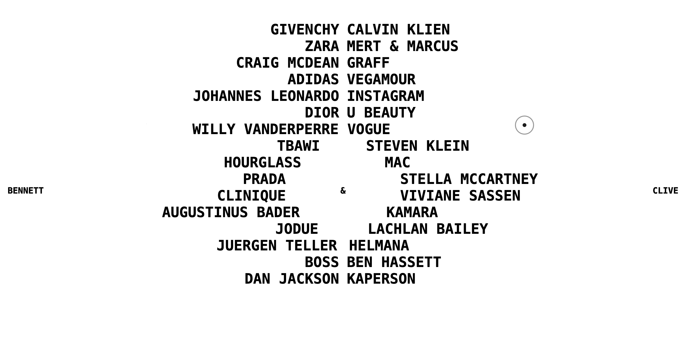

# Text Scroll Animation

 

This project is a text scroll animation implemented in JavaScript, Gsap, HTML, and CSS.

## Features

- Minimal Design
- Smooth Scrolling Animation
- Custom cursor
- GSAP Animations
- Easy to Use

## Usage

To use this, simply open the `index.html` file in your web browser.

## Author

- [Farid Vatani - Software Engineer](https://github.com/faridvatani)

## Contributing

Contributions are welcome. Please feel free to fork this repository and open a pull request to add more features, fix bugs, improve documentation etc.

## Acknowledgements

This project was inspired by the "Awwwards Element" from [Bennett & Clive](https://bennettandclive.com/).

## License

This project is licensed under the MIT License. See the [LICENSE](LICENSE) file for more details.
